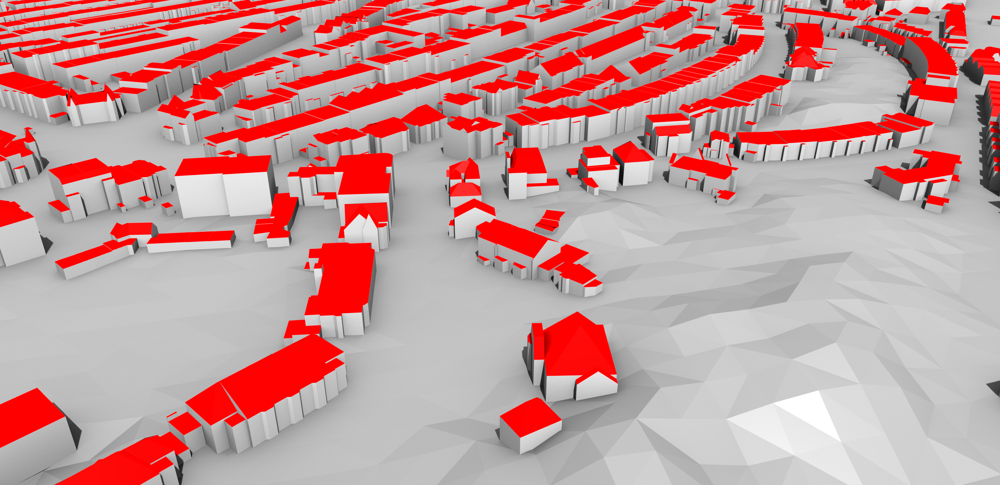

# What is CityGML?

{: width="800px"}
 *Excerpt of the CityGML model (LOD2) of The Hague, Netherlands (open dataset).*  

CityGML is an open standardised data model and exchange format to store digital 3D models of cities and landscapes.
It defines ways to describe all common 3D features and objects found in cities, such as buildings, roads, rivers, bridges, vegetation and city furniture.
It also defines different standard levels of detail (LoDs) for the 3D objets.

By using CityGML, you can build on the extensive expertise on 3D city modelling that has accumulated over the years. There is now a growing community, a body of [research and material]({{ site.baseurl }}/material/), plenty of [software tools]({{ site.baseurl }}/software/) that support the format, and a long list of potential [applications]({{ site.baseurl }}/applications/).

## What can be stored in CityGML?

CityGML mainly describes the geometry and attributes of different kinds of city objects. These can be supplemented with textures in order to give a better impression of their appearance. Specific relationships between different objects can also be stored using CityGML.

<!-- 

  

  

 -->

The types of objects stored in CityGML are grouped into different modules. These are:

* Appearance: textures and materials for other types
* Bridge: bridge-related structures, possibly split into parts
* Building: the exterior and possibly the interior of buildings with individual surfaces that represent doors, windows, etc.
* CityFurniture: benches, traffic lights, signs, etc.
* CityObjectGroup: groups of objects of other types
* Generics: other types that are not explicitly covered
* LandUse: areas that reflect different land uses, such as urban, agricultural, etc.
* Relief: the shape of the terrain
* Transportation: roads, railways and squares
* Tunnel: tunnels, possibly split into parts
* Vegetation: areas with vegetation or individual trees
* WaterBody: lakes, rivers, canals, etc.

## How are objects stored in CityGML?

In its most common implementation, which is the ones generally used to disseminate and exchange data, CityGML datasets consist of a set of plain text files and possibly some accompanying image files that are used as textures. Each text file can represent a part of the dataset, such as a specific region, a specific type of object (such as a set of roads), or a predefined LoD.

The structure of a CityGML file is a hierarchy that ultimately reaches down to individual objects and their attributes. These objects have a geometry that is described using [GML](https://en.wikipedia.org/wiki/Geography_Markup_Language).

Another important implementation of CityGML is the one of [3D City DB](http://www.3dcitydb.org), which stores CityGML in a database.

## CityGML as a standard

CityGML is an open standard that can be used free of charge.
It has been realised as an open data model and is implemented as a GML application schema. 
Because CityGML is based on GML, it can be used with the whole family of GML-compatible [Open Geospatial Consortium](http://www.opengeospatial.org) (OGC) web services for data access, processing, and cataloging, such as Web Feature Services, Web Processing Services, and Catalog Services. 

CityGML was originally developed by the members of the [Special Interest Group 3D](http://www.ikg.uni-bonn.de/sig3d) (SIG 3D) of the initiative [Geodata Infrastructure North-Rhine Westphalia](http://www.gdi-nrw.org/) (GDI NRW) in Germany. 
It is now developed and maintained by the OGC.