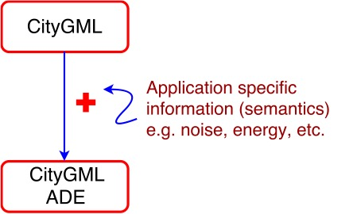

- - -

* Table of Content
{:toc}

- - -

  <b><h2>Application Domain Extensions (ADEs)</h2></b>  

CityGML is an XML based 3D data standard for the representation, storage and exchange of 3D city models. 
CityGML represents the geometry, graphical appearance and semantics associated with the 3D city models.
CityGML has a geometric model and a thematic model.
The thematic model of CityGML covers various classes like <i>buildings, relief, transportation, landuse, tunnels, bridges, vegetation, water bodies and city furniture.</i>
 
 
Sometimes, users may want to model objects and attributes of 3D city models which are not covered in the data model of CityGML.
CityGML has the concept of <i>ADEs (Application Domain Extensions)</i> to model user defined objects and attributes.
An ADE is defined in an extra XSD (XML Schema Definition) file with its own namespace. 
This file has to explicitly import the XML schema definition of the extended CityGML modules.
ADEs can be defined by information communities which are interested in specific application fields. 
ADEs are increasingly being used in creating application specific extensions like for energy modelling, modelling topographic data, indoor modelling, noise modelling, etc.
The advantage of using the ADE approach are:
<ul>
<li>The extensions are formally specified.</li>
<li>Semantic and syntactic interoperability for the exchange of application specific information.</li>
<li>Extended CityGML instance documents can be validated against the ADE schema. </li>
<li>More than one ADE can be actively used in the same dataset.</li>
<li>ADEs can have their own codelist. </li>
</ul>  

Another approach is to use <i>Generic objects and attributes.</i>
This is a semi structured extension mechanism of adding application specific attributes and objects to city objects without making any changes in the CityGML schema.
The generic extensions of CityGML are provided by the CityGML thematic module <i>Generics</i>.
But they have their own limitations, namely:
<ul>
<li>There is no formal specification of the names and data types of generic attributes/objects.</li>
<li>CityGML datasets with generic atttributes/objects cannot be validated against the schema.</li>
<li>Name conflicts of the generic attributes and objects may occur.</li>
<li>Using Generics limits semantic and syntactic interoperability.</li>
</ul>

 
  

      
       
       
       
      

       
      
       
      
      CityGML ADE Modelling
    
    

    

    

    

  

 

  <b><h2>CityGML ADEs</h2></b>  







    <h4 class="panel-title">
      <a data-toggle="collapse" data-parent="#panel" href='#{{ adeid.first }}' class="panel-toggle">
        
        {{ i.name }}
      </a>
    </h4>
  

<table class="table table-condensed table-hover table-responsive">
  <tr>
    <td><b>Description:</b></td>
    <td>{{ i.description }}</td>
  </tr>
  <tr>
    <td><b>ADE Version:</b></td>
    <td>{{ i.adeversion }}</td>
  </tr>
  <tr>
    <td><b>CityGML Version:</b></td>
    <td>{{ i.cityversion }}</td>
  </tr>  
  <tr>
    <td><b>Status:</b></td>
    <td>{{ i.status }}</td>
  </tr>    
  <tr>
    <td><b>Contact Organization:</b></td>
    <td>{{ i.contactorg }}</td>
  </tr>  
  <tr>
    <td><b>XML Schema:</b></td>
    <td> <a href="{{ i.xmlschema }}">{{ i.name }} XSD</a></td>
  </tr>  
  <tr>
    <td><b>UML Schema:</b></td>
    <td> <a href="{{ i.umlschema }}">{{ i.name }} UML</a></td>
  </tr> 
  <tr>
    <td><b>Publication:</b></td>
    <td> <a href="{{ i.publication }}">{{ i.name }} Publication</a></td>
  </tr>  
</table>



<!-- - - - 

# CityGML ADE Modelling -->

