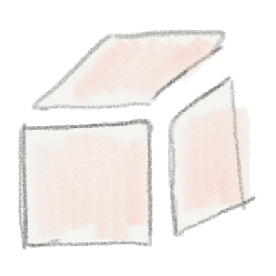
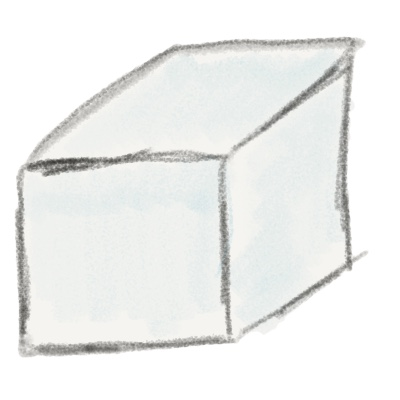
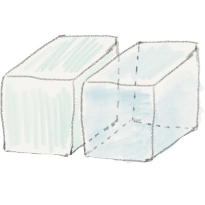
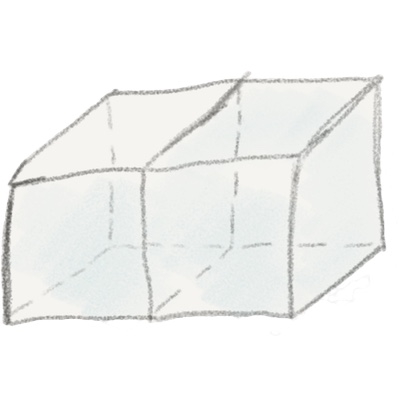

# GML geometric primitives examples

* Table of Content
{:toc}

- - - 

## gml:MultiSurface

<i class="fa fa-download" aria-hidden="true"></i> <a href="one_multisurface.gml">one_multisurface.gml</a>

  

    
  

  

    
    <gml:MultiSurface>
      <gml:surfaceMember>
        <gml:Polygon>
          <gml:exterior>
            <gml:LinearRing>
              <gml:pos>0.00 0.00 0.00</gml:pos>
              <gml:pos>0.00 1.00 0.00</gml:pos>
              <gml:pos>1.00 1.00 0.00</gml:pos>
              <gml:pos>1.00 0.00 0.00</gml:pos>
              <gml:pos>0.00 0.00 0.00</gml:pos>
            </gml:LinearRing>
          </gml:exterior>
        </gml:Polygon>
      </gml:surfaceMember>
    </gml:MultiSurface>
    
  

- - - 

## gml:Solid

<i class="fa fa-download" aria-hidden="true"></i> <a href="one_solid.gml">one_solid.gml</a>

  

    
  

  

  
<gml:Solid>
  <gml:exterior>
    <gml:CompositeSurface>
      <gml:surfaceMember>
        <gml:Polygon>
          <gml:exterior>
            <gml:LinearRing>
              <gml:pos>0.0 0.0 0.0</gml:pos>
              <gml:pos>0.0 1.0 0.0</gml:pos>
              <gml:pos>1.0 1.0 0.0</gml:pos>
              <gml:pos>1.0 0.0 0.0</gml:pos>
              <gml:pos>0.0 0.0 0.0</gml:pos>
            </gml:LinearRing>
          </gml:exterior>
        </gml:Polygon>
      </gml:surfaceMember>
      ...
    </gml:exterior>
  </gml:CompositeSurface>
</gml:Solid>


- - -

## gml:MultiSolid

<i class="fa fa-download" aria-hidden="true"></i> <a href="one_multisolid.gml">one_multisolid.gml</a>

  

    
  

  

  
<gml:MultiSolid>
  <gml:solidMember>
    <gml:Solid>
      <gml:exterior>
        <gml:CompositeSurface>
          <gml:surfaceMember>
            <gml:Polygon>
              <gml:exterior>
                <gml:LinearRing>
                  <gml:pos>0.00 0.00 0.00</gml:pos>
                  <gml:pos>0.00 100.00 0.00</gml:pos>
                  <gml:pos>100.00 100.00 0.00</gml:pos>
                  <gml:pos>100.00 0.00 0.00</gml:pos>
                  <gml:pos>0.00 0.00 0.00</gml:pos>
                </gml:LinearRing>
              </gml:exterior>
            </gml:Polygon>
          </gml:surfaceMember>
          <gml:surfaceMember>
          ...
          </gml:surfaceMember>
        </gml:CompositeSurface>
      </gml:exterior>
    </gml:Solid>
  </gml:solidMember>
  <gml:solidMember>
    <gml:Solid>
    ...
    </gml:Solid>
  </gml:solidMember>
</gml:MultiSolid>


- - -

## gml:CompositeSolid

<i class="fa fa-download" aria-hidden="true"></i> <a href="one_compositesolid.gml">one_compositesolid.gml</a>

  

    
  

  

  
<gml:CompositeSolid>
  <gml:solidMember>
    <gml:Solid>
      <gml:exterior>
        <gml:CompositeSurface>
          <gml:surfaceMember>
            <gml:Polygon>
              <gml:exterior>
                <gml:LinearRing>
                  <gml:pos>0.00 0.00 0.00</gml:pos>
                  <gml:pos>0.00 100.00 0.00</gml:pos>
                  <gml:pos>100.00 100.00 0.00</gml:pos>
                  <gml:pos>100.00 0.00 0.00</gml:pos>
                  <gml:pos>0.00 0.00 0.00</gml:pos>
                </gml:LinearRing>
              </gml:exterior>
            </gml:Polygon>
          </gml:surfaceMember>
          <gml:surfaceMember>
          ...
          </gml:surfaceMember>
        </gml:CompositeSurface>
      </gml:exterior>
    </gml:Solid>
  </gml:solidMember>
  <gml:solidMember>
    <gml:Solid>
    ...
    </gml:Solid>
  </gml:solidMember>
</gml:CompositeSolid>


